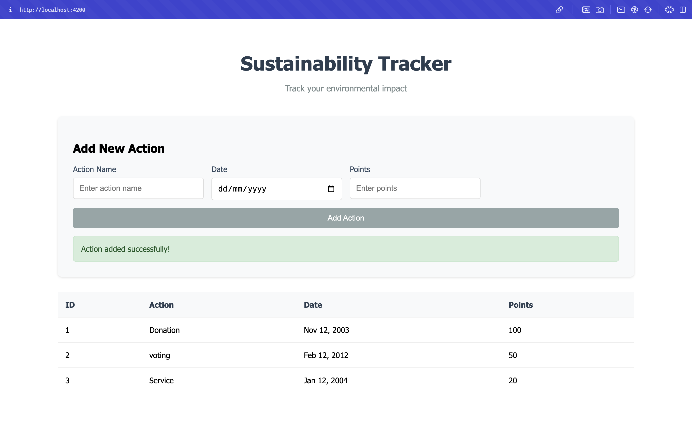

# Sustainability Tracker

A simple web application for tracking sustainability actions. Users can add and view environmental actions they take, with each action having a point value.

## Setup

### Backend

1. Go to backend folder:

```
cd backend
npm install
```

2. Install required packages:

```
npm install express cors
```

3. Start the server:

```
node server.js
```

Server runs on http://localhost:3000

### Frontend

1. Go to frontend folder:

```
cd frontend
npm install
```

2. Start Angular app:

```
ng serve
```

Website runs on http://localhost:4200

### Project Frontend Screenshot:



## How It Works

The program lets you:

- Add new sustainability actions with dates and points
- View all recorded actions in a table
- Store actions permanently using a JSON file

Backend stores data in data.json file. Frontend communicates with backend using HTTP requests.

## Files

Backend:

- server.js: Main server file with API endpoints
- data.json: Stores all actions (created automatically)

Frontend:

- sustainability.service.ts: Handles API calls
- sustainability-tracker.component.ts: Main component logic
- sustainability-tracker.component.html: Page layout
- sustainability-tracker.component.css: Styling

## Requirements

- Node.js
- Angular CLI
- Modern web browser
- Internet connection (for dependencies)

## Common Issues

If server won't start:

- Check if port 3000 is free
- Make sure all packages are installed
- Check if data.json has proper permissions

If frontend won't connect:

- Verify backend is running
- Check if CORS is enabled
- Make sure ports match in service file

Contact: ptssherpa5@gmail.com
